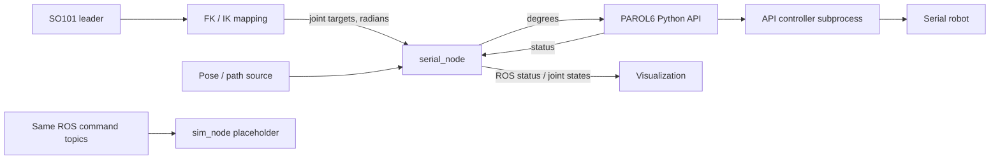

# Robot workspace — Python API experiment

This branch, `feature/python-api`, replaces the custom C++ runtime with the upstream PAROL6 Python API behind a ROS server. The previous implementation was committed as `d5d4954` on `basic` and merged into local `main` before this experiment.

## Packages

| Location | Responsibility |
| --- | --- |
| `src/robot_server/scripts/serial_node.py` | ROS command ownership, acknowledgements, unit conversion and hardware status |
| `src/robot_server/robot_server_core/controller.py` | Owns the PAROL6 API controller subprocess and async client |
| `src/robot_server/scripts/sim_node.py` | Inert runnable placeholder with the same command subscriptions; no application publications |
| `src/robot_teleop/scripts/so101.py` | SO101 leader ROS node |
| `src/robot_teleop/robot_teleop/fk_ik_map.py` | Application-specific encoder/frame/gripper mapping |
| `external/robot_kinematics` | Pinocchio model loading, FK and Jacobian IK; no ROS or robot API dependency |
| `src/robot_path` | Joint pose commands and Cartesian path planning |
| `src/robot_description` | Robot URDFs, meshes, profiles and joint contracts |
| `src/model_client`, `src/robot_data` | Policy transport and offline dataset/training utilities |

Pinocchio reads URDF joint limits, joints and frames directly. `Chain` contains only model/layout data; FK is a function, and `PoseIK` owns solver scratch data, Jacobian updates and integration. No `UrdfModel` wrapper or second XML parser remains in the kinematics library.


```mermaid
flowchart LR
    Leader[SO101 leader] --> Mapping[FK / IK mapping]
    Mapping -->|joint targets, radians| Serial[serial_node]
    Pose[Pose / path source] --> Serial
    Serial -->|degrees| API[PAROL6 Python API]
    API --> Controller[API controller subprocess]
    Controller --> Robot[Serial robot]
    API -->|status| Serial
    Serial -->|ROS status / joint states| Viewer[Visualization]
    Commands[Same ROS command topics] --> Sim[sim_node placeholder]
```

## Install and run

```sh
pixi install -e ros
pixi run -e ros setup-ros --build-only
```

In separate terminals, when ready to operate the physical robot:

```sh
pixi run server-parol6-serial
pixi run home
pixi run teleop
pixi run engage
```

Use `pixi run disengage` to pause. `pose` and `standby` upload timed API joint moves. `server-stop` stops the serial server and its API child; `server-parol6-serial restart:=true` fully restarts it. Launch visualization separately with `visualize-parol6` and `foxglove`.

`pixi run server` starts the simulation placeholder. It accepts messages and does nothing: no motion, observations or status. Simulation, recording and evaluation are deferred on this branch. Dataset preparation/training from existing recordings remain separate under `environments/models`.

See [serial architecture and limitations](src/robot_server/SERIAL.md), [teleop](src/robot_teleop/README.md), [path source](src/robot_path/README.md), and [kinematics](external/robot_kinematics/README.md).
